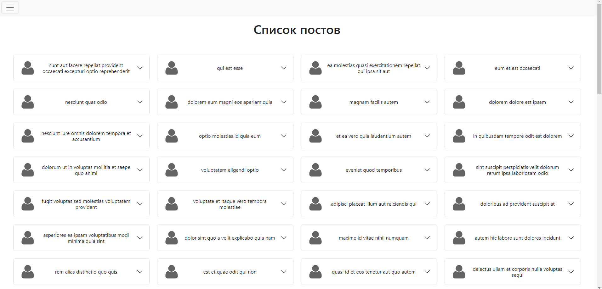
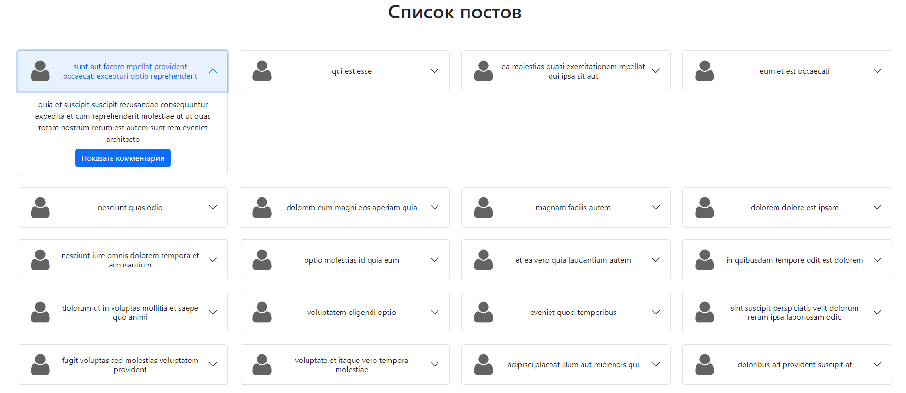
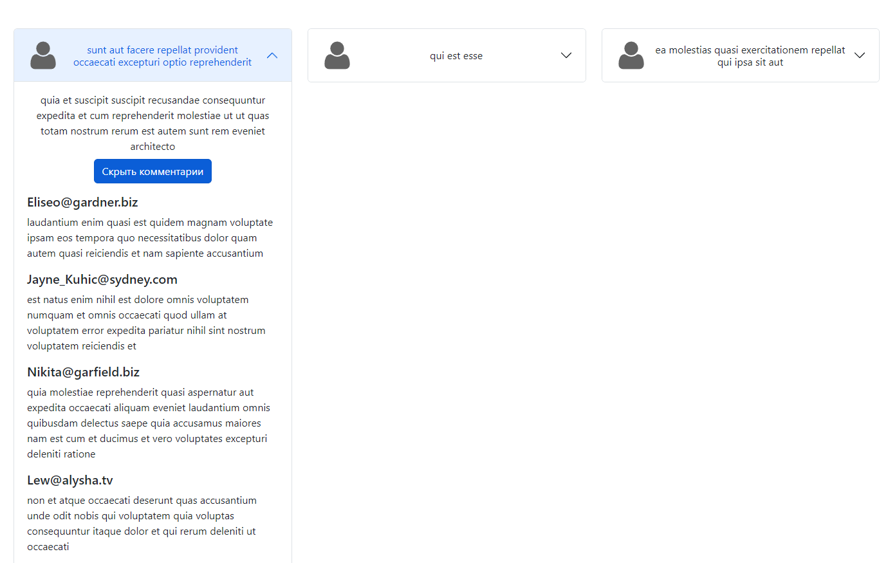
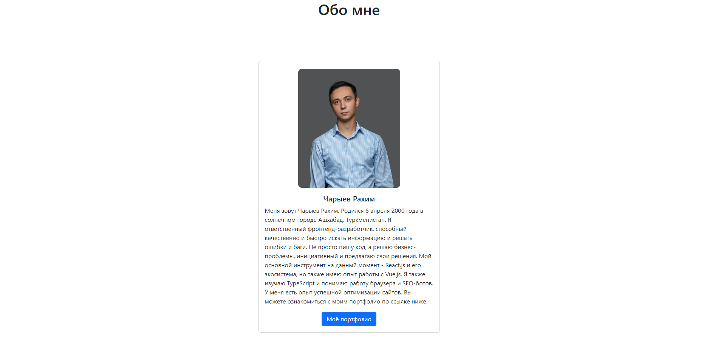

<h1 align="center" id="top">React Posts App</h1>

<div align="center">
&#xa0;
<a href="https://react-about-app.vercel.app/">PRODUCTION</a>
</div>

<p align="center">
  

  

  

  <!--  -->

  <!--  -->

  <!--  -->

  
</p>

<!-- Status -->

<!-- <h4 align="center">
	🚧  Youtube Search 🚀 Under construction...  🚧
</h4>

<hr> -->

<p align="center">
  <a href="#dart-about">About</a> &#xa0; | &#xa0; 
  <a href="#sparkles-features">Features</a> &#xa0; | &#xa0;
  <a href="#rocket-technologies">Technologies</a> &#xa0; | &#xa0;
  <a href="#white_check_mark-requirements">Requirements</a> &#xa0; | &#xa0;
  <a href="#checkered_flag-starting">Starting</a> &#xa0; | &#xa0;
  <a href="#memo-screenshots">Screenshots</a> &#xa0; | &#xa0;
  <a href="#memo-contact">Contacts</a> 
</p>

<br>

## :dart: About

This is a web application developed with React.js that contains posts, where there are 3 pages. The data is obtained through a fake api: https://jsonplaceholder.typicode.com. The app is already deployed! You can check it by the link in description.

## :sparkles: Features

:heavy_check_mark: List of posts (main page), where all posts are located.\
:heavy_check_mark: About me, where is a brief information about me.\
:heavy_check_mark: Details about the user (when you need to display information about the user and a list of his posts).\

## :rocket: Technologies

The following tools were used in this project:

- [React](https://pt-br.reactjs.org/)
- [React Router Dom](https://reactrouter.com/en/main)
- [Axios](https://axios-http.com/docs/intro)
- [React-bootstrap](https://react-bootstrap.github.io/docs/getting-started/introduction/)
- [Redux](https://redux.js.org/)
- [Redux-saga](https://redux-saga.js.org/docs/api/)
- [Redux-thunk](https://redux.js.org/usage/writing-logic-thunks)

## :white_check_mark: Requirements

Before starting :checkered_flag:, you need to have [Git](https://git-scm.com) and [Node](https://nodejs.org/en/) installed.

## :checkered_flag: Starting

```bash
# Clone this project
$ git clone https://github.com/RahymCharyyev/react-posts-app

# Access
$ cd react-posts-app

# Install dependencies
$ npm install

```

```bash

# Run the project

$ npm run dev

# The server will initialize in the <http://localhost:4000>

```

## :memo: Screenshots

 \
&#xa0;
 \
&#xa0;
 \
&#xa0;
 \
&#xa0;

## :memo: Contact

For any inquiries or questions, please contact <a href="https://github.com/RahymCharyyev" target="_blank">Rahym Charyyev</a>

&#xa0;

<a href="#top">Back to top</a>
